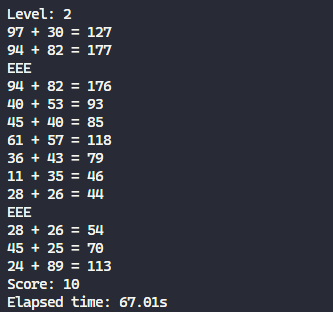
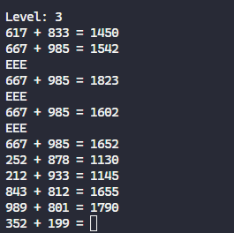
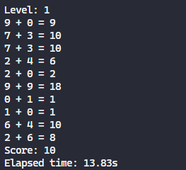

# addition-game
A simple addition game I created on *VS Code* using **Python.** This game is part of an online python course that I am currently undertaking on [edX](https://www.edx.org/course/cs50s-introduction-to-programming-with-python).

## Screenshots
### **Gameplay:**
User can input level at the beginning of the game.

### **Three consecutive mistakes:**
Answer is given for the question the user gets wrong thrice.

### **Game ending:**
Total score and time elapsed are displayed at the end.

